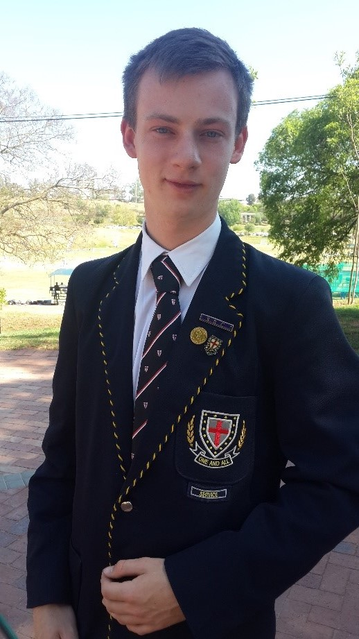

# Stuart Barclay

|                                                       |                                                                                                                                                                                                                                                                                                                                                                                                                                                                                                                                                                                                                                                                                                                                                                                                            |
| :---------------------------------------------------: | :--------------------------------------------------------------------------------------------------------------------------------------------------------------------------------------------------------------------------------------------------------------------------------------------------------------------------------------------------------------------------------------------------------------------------------------------------------------------------------------------------------------------------------------------------------------------------------------------------------------------------------------------------------------------------------------------------------------------------------------------------------------------------------------------------------: |
|                ## Personal Information                |                                                                                                                                                                                                                                                                                                                                                                                                 ##About Me                                                                                                                                                                                                                                                                                                                                                                                                 |
|  | A motivated, tenacious, adaptable and responsible young individual, seeking a career in the Information Technology Environment which will develop and strengthen my professional and technical skills to the maximum and beyond. I have a methodical, customer focused approach to tasks and a strong drive to ensure that tasks are seen through to completion. My hard working attributes and eagerness to overcome challenges defines me, either in a well configured team or as an individual delivering the very best. I embrace new opportunities that expose me to new technologies and welcome every opportunity to do so. I am proficient with Web development, specifically with back-end development as my preference, but have an appetite to develop further skills on front-end development. |
|                     :----------:                      |                                                                                                                                                                                                                                                                                                                                                                                                   :----:                                                                                                                                                                                                                                                                                                                                                                                                   |

## Interests

- Cycling
- Running
- Gaming
- Software Development
  - C++
  - Nodejs
  - Java
  - Python
  - C#
  - HTML
  - Javascript
  - XML
  - ReactJS
  - PHP
- Music
- Psychology

## Skills

- Project Management
- Diplomatic
- Receptive
- Attentive

## Education

- Matriculated 2014 - St Stithians Boys College
- BA Sport Psychology - University of Pretoria (2015 - 2017)
- B.IT - University of Pretoria (2018 - Present)

## Work Experience

- Synertech
- Freelance Web Developer
- High school tutor (2015 - Present)

## Accolades

- Member of the Golden Key Honour Society
- Honours for community service at a school level

## Attitudes

- Work hard but not at the expense of others
- Resolve conflicts as soon as they arise
- Enjoy team work when everyone pulls their weight

## Links

[GitHub](https://github.com/Stuey61296)  
[LinkedIn](https://www.linkedin.com/in/stuart-barclay-73770019a/)
